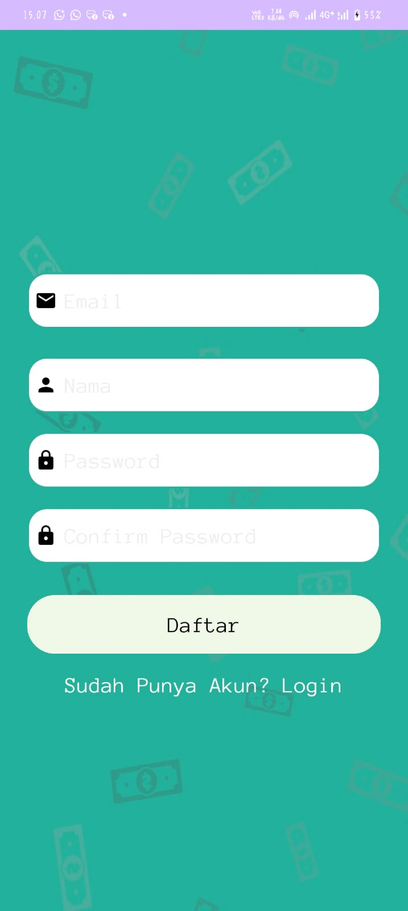
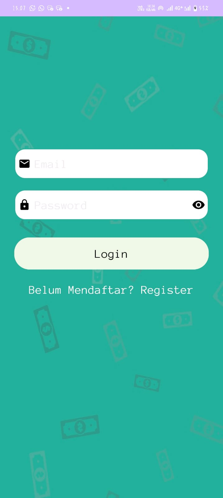
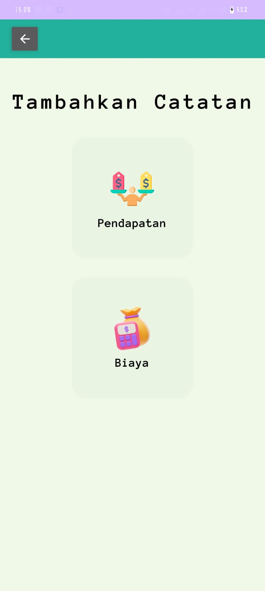
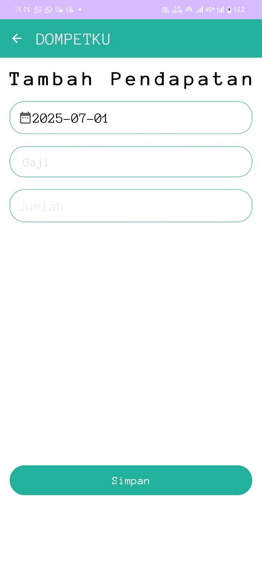
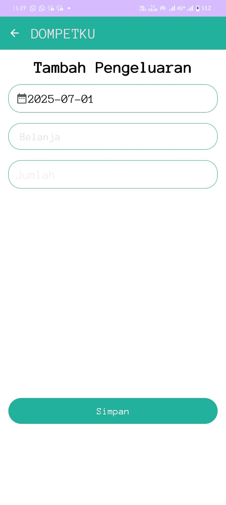
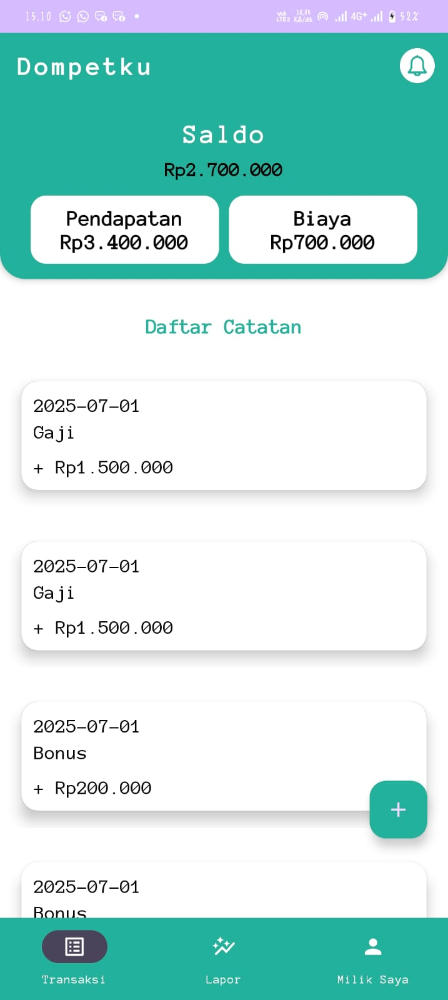
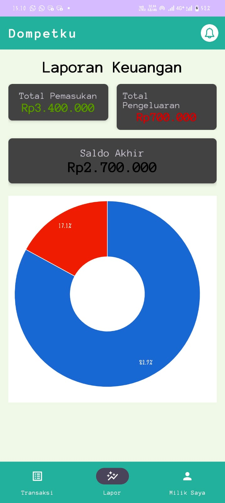
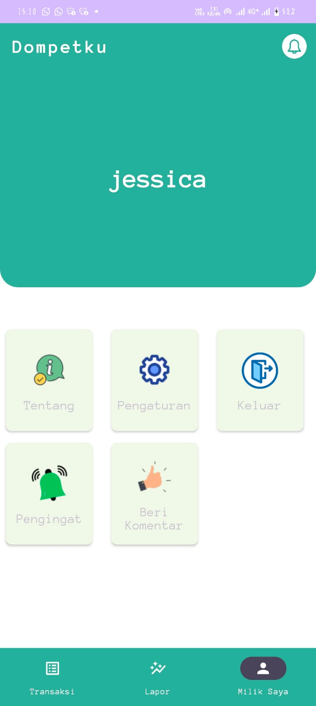

# Aplikasi Catatan Pengeluaran

Projek UTS-UAS Praktikum Mobile

## Anggota Kelompok
- Jessica Andriyani | F55123051
- Horas Imanuel Siregar | F55123053
- Syahril Fitrawan Abadi | F55123054

## Deskripsi Aplikasi
Aplikasi Android untuk mengelola keuangan dengan fitur pencatatan pemasukan dan pengeluaran.

## Fitur Utama
- Pencatatan pemasukan
- Pencatatan pengeluaran
- Navigasi bottom bar

## Berikut Tampilan dari hasil projek yang telah kami buat:

### Tampilan Register

### Tampilan Login

### Tampilan Tambah Catatan

### Tampilan Tambah Pendapatan

### Tampilan Tambah Biaya

### Tampilan Home

### Tampilan laporan

### Tampilan Account

## Teknologi
- Java
- Android SDK
- RecyclerView
- Fragment
- Material Design
